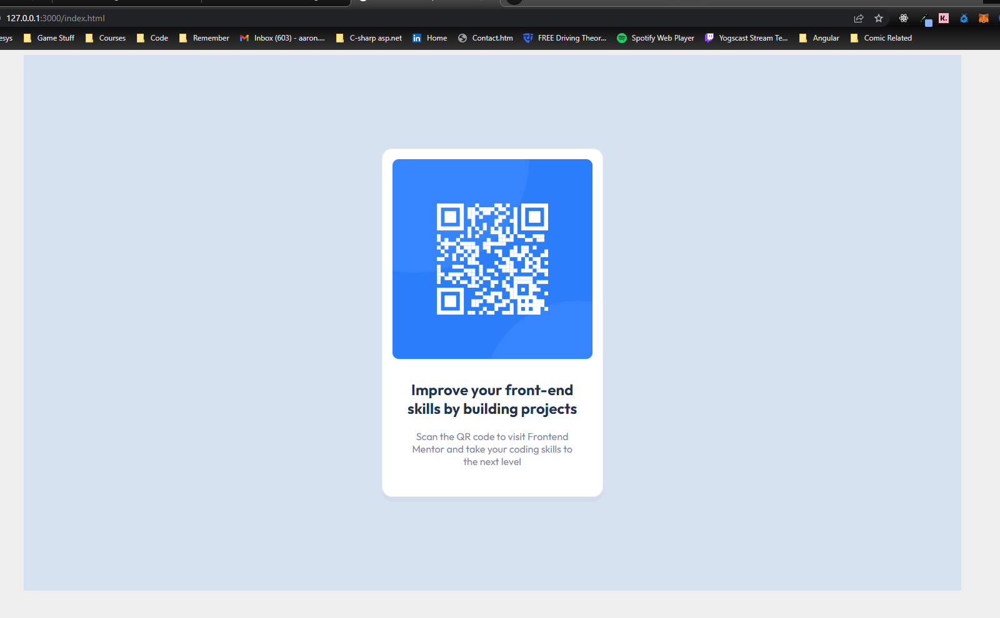

# Frontend Mentor - QR code component solution

This is a solution to the [QR code component challenge on Frontend Mentor](https://www.frontendmentor.io/challenges/qr-code-component-iux_sIO_H). Frontend Mentor challenges help you improve your coding skills by building realistic projects. 

## Table of contents

- [Overview](#overview)
  - [Screenshot](#screenshot)
  - [Links](#links)
- [My process](#my-process)
  - [Built with](#built-with)
  - [Continued development](#continued-development)
- [Author](#author)

## Overview

### Screenshot

### Links

- Solution URL: [github.com](https://github.com/ageddesi/fem-qr-code-component)
- Live Site URL: [Github Pages](https://ageddesi.github.io/fem-qr-code-component)

## My process

### Built with

- Semantic HTML5 markup
- CSS Variables
- Media Queries
- Flexbox

### Continued development

- We could spend more time making the design be based on percentages so the mobile scales on the smaller breakpoint and below.

## Author

- Website - [www.aaronsserver.co.uk](https://www.aaronsserver.co.uk)
- Frontend Mentor - [@ageddesi](https://www.frontendmentor.io/profile/ageddesi)
- Twitter - [@aaron_rackley](https://twitter.com/Aaron_Rackley)
